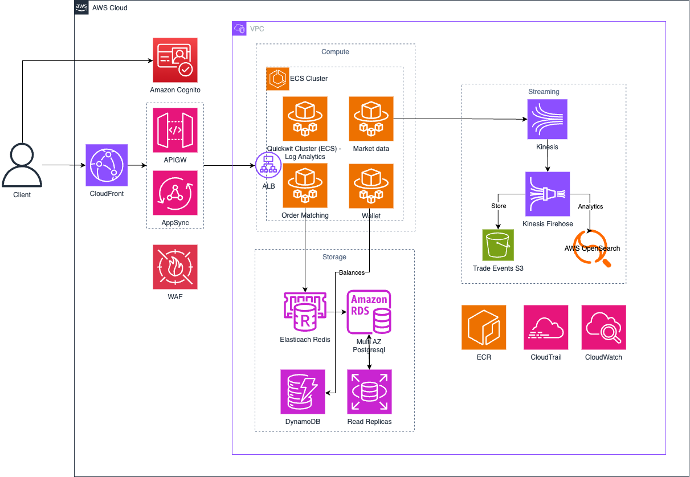

## Diagram

## I. Overview
#### Features:
- Order placement, matching, and excution
- Price feed
- Porfolio
#### Non-functional requirements:
- High availability
- Scalability
- Low Latency
- Cost-effective
#### Capacity requirement
- 500 RPS
- p99 response time of <100ms

#### AWS Service Use:
- ***FE & API***: CloudFront, APIGW, ALB, AppSync
- ***Compute layer***: ECS, SQS
- ***Streaming layer***: Kinesis, Kinesis Data Firehose, AWS OpenSearch
- ***Database***: RDS, Redis, s3 

## II. Service used & Alternatives consideration
#### 1. Frontend & API Layer:
- ***Client***: Represents users (web browsers, mobile apps, trading bots) interacting with the platform.
- ***Amazon Cognito***: Handles user identity and access management. Used for user registration, login, authentication, and potentially authorization for accessing APIs.
- ***API Gateway (APIGW)***: Acts as the main entry point for REST API requests. It's responsible for:
- API Management: Handling API requests, routing, rate limiting.
- ***Application Load Balancer (ALB)***: Manages WebSocket connections for real-time communication. Primarily used for streaming real-time market data updates to clients.
- ***AppSync***: Provides a GraphQL API endpoint. Offers a flexible way for clients to query and subscribe to real-time data, potentially used for more complex data retrieval and real-time updates beyond just raw market data streams.
- ***WAF (AWS WAF)***: Web Application Firewall protecting the API Gateway, ALB, and AppSync from common web exploits and DDoS attacks, enhancing security at the API layer.
#### 2. Compute Layer:
- ***ECS Cluster (Amazon Elastic Container Service Cluster)***: The core compute environment where the application services run, using containers.
- ***ECS Services***:
  - ***Order Matching***: The heart of the exchange, responsible for matching buy and sell orders based on price and time priority. Implemented as a stateless microservice within ECS Fargate for scalability.
  - ***Wallet***: Manages user wallets and tracks balances for different cryptocurrencies. Another stateless microservice suitable for ECS Fargate.
  - ***Market data***: Aggregates and processes market data (trades, order book updates, tickers) and streams real-time updates. Also runs as a scalable microservice within ECS Fargate.
- ***ECS Quickwit Cluster - log Analytics***: Handling log aggregation, search, and analytics for all platform components.

=> ***Alternative*** 
- ***EKS***
  - Running all services on EKS cluster which give us more control on our services, monitoring tools, logs tools and infrastructure.
  - *Tradeoffs:*
    - Maintainance cost: Setup, maintainance
    - Higher price in the first phase
#### 3. Streaming Layer:
- ***Kinesis (Amazon Kinesis Data Streams)***: Acts as a real-time data stream for trade events and potentially other market data events. Provides a scalable and durable pipeline for event ingestion and distribution.
- ***Kinesis Firehose (Amazon Kinesis Data Firehose)***: Used to deliver the Kinesis data stream to different destinations. In this design, it's shown delivering to:
- ***Trade Events S3 (Amazon S3)***: For long-term storage and archiving of raw transaction/trade events, creating a data lake.
- ***AWS OpenSearch***: For real-time analytics and search on the transaction/trade data.
#### 4. Storage Layer:
- ***ElastiCache Redis***: In-memory data store, used for:
  - *Order Book*: Storing the active order books for trading pairs for fast access by the Order Matching engine.
  - *Caching*: Potentially caching frequently accessed market data for low latency access by the Market Data service.
- ***Amazon RDS (Relational Database Service) - PostgreSQL***: Used as the primary transactional database. Likely stores:
  - *User Data*: User profiles, account information.
  - *Order Data*: Persistent records of placed orders.
  - *Trade History*: Records of executed trades.
- **Read Replicas (AWS RDS Read Replicas)**: Offload read traffic from the primary RDS PostgreSQL instance, improving read performance and availability for read-heavy operations like fetching user data or historical trades.
- ***DynamoDB (Amazon DynamoDB)***: NoSQL database used for storing user balances. Chosen for its high scalability, throughput, and low latency for balance updates, which are critical for a trading platform.
#### 5. Monitoring & Audit Layer:
- ***CloudTrail (AWS CloudTrail)***: Auditing service that logs API calls made within the AWS account. Crucial for security, compliance, and tracking changes made to the infrastructure and services.
- ***CloudWatch (Amazon CloudWatch)***: Monitoring and observability service used for:
  - *Metrics Collection*: Gathering performance metrics from all AWS services and application components.
  - *Logs*: Gathering application logs for furth er intervestigation.
  - *Alarms and Notifications*: Setting up alarms based on metrics to detect anomalies or performance issues and trigger notifications via SNS.

## III. Scaling the System
#### Frontend & API Layer Scaling:
- ***AWS CloudFront***:
  - Scaling Strategies:
    - Optimize Caching: Fine-tune cache behaviors (TTLs, cache keys) to maximize cache hit ratios and offload origin servers. Implement cache invalidation strategies for dynamic content updates.

- ***API Gateway (APIGW)***:
  - Scaling Strategies:
    - Implement Caching (within API Gateway or Backend): Cache frequently accessed API responses where appropriate (with proper cache invalidation strategies) to reduce load on backend services.
    - Increase API Gateway Limits: AWS service limits are generally very high for API Gateway, but if you approach them, you can request limit increases from AWS support.
#### Compute Layer (ECS Fargate) Scaling:
- ***ECS Service on Fargate***:
  - Scaling Strategies:
    - Horizontal Scaling
    - Database Connection Pooling
- ***Quickwit Cluster (ECS Fargate)***:
  - Scaling Strategies:
    - Horizontal Scaling
    - Increase Quickwit Indexing Capacity: Add more Indexer nodes to handle higher log ingestion rates.
    - Increase Quickwit Search Capacity: Add more Searcher nodes to handle increased query load and improve query latency.
    - Optimize Quickwit Configuration: Fine-tune Quickwit indexing strategies, data retention policies, and resource allocation to optimize performance and cost.
#### Storage Layer Scaling:
- ***ElastiCache Redis***:
  - Scaling Strategies:
    - Vertical Scaling: Instance Size
    - Horizontal Scaling (Cluster Mode and Sharding): Enable ElastiCache Redis Cluster Mode to shard data across multiple nodes for increased capacity and throughput.
    - Add Read Replicas
    - Optimize Data Structures and Access Patterns: Ensure efficient data structures within Redis and optimized access patterns to minimize latency and resource usage.
- ***RDS PostgreSQL***:
  - Scaling Strategies:
    - Vertical Scaling: Instance Size
    - Add Read Replicas: Increase the number of RDS Read Replicas to offload read traffic from the primary instance.
    - Read Replica Load Balancing
    - Query Optimization: Optimize database queries, indexes, and schema design for performance. Use query analysis tools to identify slow queries and optimize them.
    - Connection Pooling: Ensure robust connection pooling is implemented in application services to efficiently manage database connections.
    - Consider Aurora PostgreSQL Migration
- ***DynamoDB***:
  - Scaling Strategies:
    - Leverage Auto Scaling (for Provisioned Capacity - or use On-Demand Capacity)
    - Optimize Access Patterns: Ensure efficient DynamoDB access patterns. Use batch operations for reads and writes where possible. Optimize key design to distribute workload evenly across partitions.
    - Global Tables (Multi-Region): If global user base and low-latency access across regions are critical, consider using DynamoDB Global Tables for multi-region replication and low-latency reads from the nearest region.